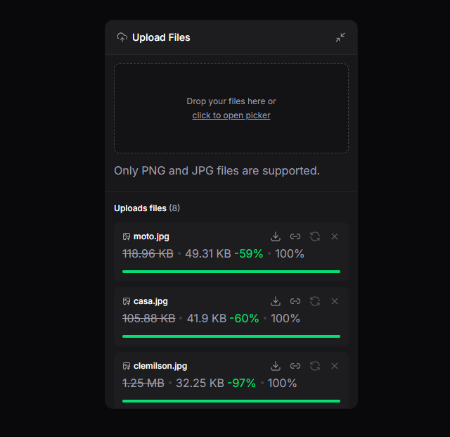

# Upload Widget

Um componente React moderno e responsivo para upload de arquivos com suporte a drag-and-drop, compressão de imagens e progresso em tempo real.

## 📸 Preview

<!-- Adicione a imagem do widget aqui -->


## ✨ Recursos

- 📤 **Drag & Drop** - Arraste e solte seus arquivos
- 🖼️ **Compressão de Imagens** - Reduz automaticamente o tamanho das imagens
- ⚡ **Upload em Tempo Real** - Acompanhe o progresso do upload
- 📊 **Visualização de Arquivos** - Lista com informações detalhadas
- 🎨 **Interface Responsiva** - Adapta-se a qualquer tela
- ♿ **Acessível** - Componentes Radix UI com suporte A11y
- 🎭 **Animações Suaves** - Motion para transições fluidas

## 🛠️ Tech Stack

- **React 19** - UI library  
- **TypeScript** - Type safety
- **Vite** - Build tool
- **Tailwind CSS** - Styling
- **Zustand** - State management
- **Radix UI** - Accessible components
- **Lucide React** - Icons
- **Axios** - HTTP client
- **React Dropzone** - Drag & drop
- **Motion** - Animations

## 📦 Instalação

```bash
# Instalar dependências
pnpm install

# Servidor backend
cd server
pnpm install
```

## 🚀 Desenvolvimento

```bash
# Terminal 1 - Frontend (Vite)
pnpm dev

# Terminal 2 - Backend (Node.js)
cd server
node index.js
```

O app estará disponível em http://localhost:5173

## 🏗️ Estrutura do Projeto

```
src/
├── components/           # Componentes React
│   ├── upload-widget.tsx      # Componente principal
│   ├── upload-widget-dropzone.tsx
│   ├── upload-widget-header.tsx
│   ├── upload-widget-upload-list.tsx
│   └── ui/                    # Componentes UI reutilizáveis
├── http/                # APIs e requisições HTTP
├── store/               # Zustand store (state management)
├── utils/               # Funções utilitárias
└── types/               # Type definitions
```

## 📝 Como Usar

```tsx
import { UploadWidget } from './components/upload-widget'

export default function App() {
  return <UploadWidget />
}
```

## 🔧 Scripts

```bash
pnpm dev      # Iniciar desenvolvimento
pnpm build    # Build para produção
pnpm lint     # Executar linter
pnpm preview  # Preview do build
```

## 📄 Licença

MIT
